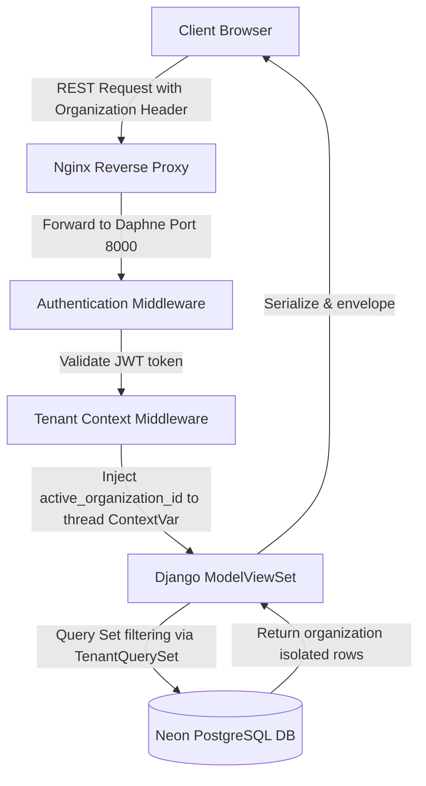
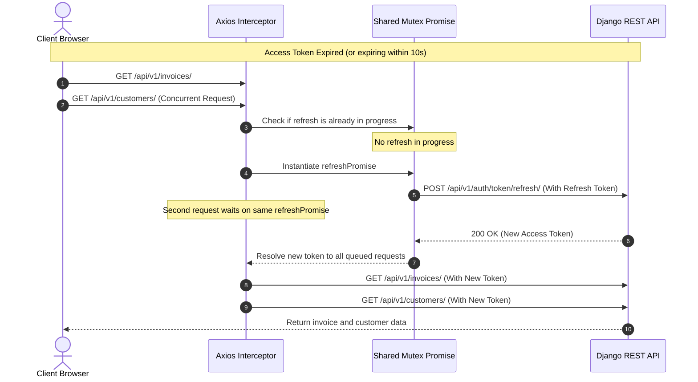
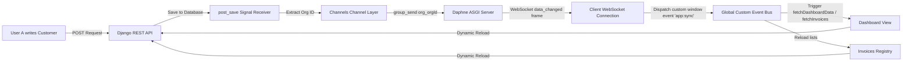
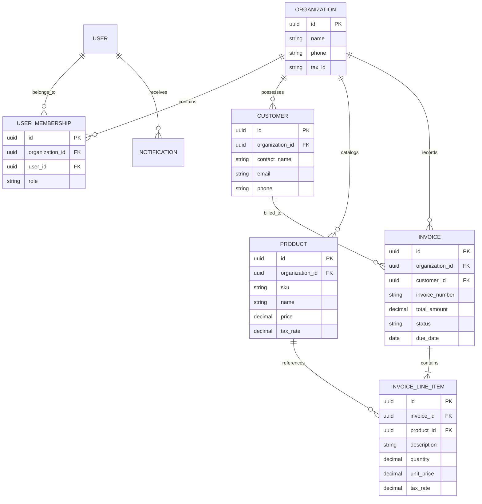

# Invoicely - Invoice Management System

<p align="center">
  
</p>

<p align="center">
  
  
  
  
  
  
  
  
</p>

<p align="center">
  <b>A premium, enterprise-grade multi-tenant SaaS platform featuring real-time state synchronization, catalog compliance checking, AI-assisted invoice generation, and strict audit log trails.</b>
</p>

<p align="center">
  
</p>

## ✨ Table of Contents
<details open>
<summary><b>📖 Click to expand</b></summary>


| 📑 Primary Sections | ⚙️ Technical Details | 📝 Project Info |
| :--- | :--- | :--- |
| 1. [🚀 Project Overview](#-project-overview) | 6. [📡 Real-Time WebSocket Sync](#-real-time-websocket-sync) | 11. [🛡️ Security Architecture](#️-security-architecture) |
| 2. [🛠️ Key Architecture Enhancements](#️-key-architecture-enhancements) | 7. [⚡ Performance Optimizations](#-performance-optimizations) | 12. [🗺️ Project Roadmap](#️-project-roadmap) |
| 3. [🔥 Core Feature Showcase](#-core-feature-showcase) | 8. [📥 Installation & Setup](#-installation--setup) | 13. [🤝 Contributing Guide](#-contributing-guide) |
| 4. [💻 Technology Stack](#-technology-stack) | 9. [🔌 API Documentation](#-api-documentation) | 14. [📄 License](#-license) |
| 5. [📊 System Architecture](#-system-architecture) | 10. [📁 Folder Structure](#-folder-structure) | 15. [👥 Authors](#-authors) |

</details>

<p align="center">
  
</p>

## 🚀 Project Overview

**Invoicely** is a multi-tenant Invoice and Client Management SaaS designed for high-performance enterprise billing. It provides secure multi-tenant isolation, automated invoice workflows (approvals, notifications, reminders), background queues, and strict transaction auditing.

### 🎯 The Problem It Solves
Modern financial systems suffer from data drift, out-of-catalog invoice edits, laggy client synchronization, and visual inconsistencies during payment transitions. Invoicely resolves these pain points through:
- 🔒 **Ledger Security & Data Isolation:** Tenant organization contexts are dynamically evaluated at the query level, eliminating data leaks between organizations.
- ⚡ **WebSocket Real-Time Sync:** Avoids database request spam. Updates broadcast instant state refresh instructions (such as customer creation or invoice status transitions) across connected clients.
- 📋 **Strict Compliance Constraints:** Invoice line rates and descriptions are locked to the catalog definitions. Price changes must occur on the catalog page, ensuring future compliance.
- 📱 **10-Digit Standardized Contacts:** Normalizes and cleans phone numbers globally, keeping contacts uniform.

<br clear="right"/>

<p align="center">
  
</p>

## 🛠️ Key Architecture Enhancements

This project has been hardened with production-grade enterprise practices:
- 🔄 **Proactive Token Refresh Mutex**: Frontend implements a custom axios interceptor which checks expiration times and queries the token refresh API *before* sending requests. Multiple concurrent requests queue behind a shared Promise mutex, preventing double refresh submissions.
- 📉 **Zero Mock Data Charts**: Real-time KPI summaries, chronological revenue graphs, and GST summaries calculate directly from database models in INR (`₹`) format. Zero-states are rendered beautifully when data is empty.
- 🛑 **Visual UX Blockers**: Forms, submit targets, and modals disable automatically during active transactions (`isSubmitting` flag), displaying responsive "Saving..." indicators.
- 🛡️ **Resilient Fallback Middleware**: If a local development environment lacks Redis or Celery, the system dynamically switches to SQLite, in-memory local caches, and synchronous task execution.

<p align="center">
  
</p>

## 🔥 Core Feature Showcase

| 🌟 Module | 🛠️ Feature | ⚙️ Implementation Detail |
| :--- | :--- | :--- |
| 🏢 **SaaS Tenancy** | Organization Isolation | Dynamic RBAC middleware, custom `TenantQuerySet` intercepts all SQL queries based on user membership keys. |
| 📡 **WebSockets** | Live Sync & Notifications | Daphne ASGI gateway broadcasts saved/deleted signals to org groups. Frontend `app:sync` custom event fires client reloads. |
| 🔒 **Catalog Locking** | Price/Description Compliance | Read-only input cells on frontend form; validation checks catalog product records on backend serializers. |
| 🤖 **AI Smart Drafts** | NLP Prompt to Invoice | AI model processes raw texts (e.g. "consulting 75k, 10% disc") and pre-fills catalog matching rows. |
| 🖺 **OCR Extractor** | File PDF/Image Parser | Extracts lines and matches against catalog SKUs to auto-build invoice draft items. |
| 🕵️ **Auditing Trails** | Session Logging | Thread-safe `ContextVar` logs all user modifications (IP, agent, timestamp) inside `audit_logs` schemas. |

<p align="center">
  
</p>

## 💻 Technology Stack

<div align="center">
  <table>
    <tr>
      <td align="center" width="33%">
        <h3>🎨 Frontend Core</h3>
        
        
        
        <br><b>React 18 • TypeScript • Tailwind CSS</b>
        <br>Lucide Icons • Recharts
      </td>
      <td align="center" width="33%">
        <h3>⚙️ Backend Core</h3>
        
        
        <br><b>Django 4.2 • REST Framework • Daphne</b>
        <br>Celery • Redis Broker
      </td>
      <td align="center" width="33%">
        <h3>🗄️ Database & Security</h3>
        
        
        <br><b>PostgreSQL 15 • Simple JWT</b>
        <br>Django Axes • Neon Serverless
      </td>
    </tr>
  </table>
</div>

<p align="center">
  
</p>

## 📊 System Architecture

<details>
<summary><b>1️⃣ Multi-Tenant Isolated Data Flow (Click to expand)</b></summary>
<br>

All incoming API requests pass through context-injecting middlewares before hitting database models:


</details>

<details>
<summary><b>2️⃣ Proactive JWT Refresh Mutex Pattern (Click to expand)</b></summary>
<br>

The frontend interceptor resolves potential race conditions when access tokens expire concurrently:


</details>

<details>
<summary><b>3️⃣ Event-Driven Real-Time Sync Topology (Click to expand)</b></summary>
<br>

When User A alters a database object, the system broadcasts changes instantly to other active users:


</details>

<details>
<summary><b>4️⃣ Database Schema (Entity Relationships) (Click to expand)</b></summary>
<br>


</details>

<p align="center">
  
</p>

## 📡 Real-Time WebSocket Sync

Invoicely implements a production-ready WebSockets system using Django Channels to broadcast changes instantly without page refreshes.

### How it works:
1. **Signal Broadcast:** Django signals (`post_save`, `post_delete`) intercept all create, update, and delete actions on `Customer`, `Invoice`, `Product`, `Organization`, and `UserOrganizationMembership` models.
2. **WebSockets Group Send:** The signal handler automatically routes a `data_changed` event payload to the Django Channels layer, targeting the organization group `org_<org_id>`.
3. **Global Custom Event:** `NotificationCenter.tsx` catches the WebSocket frame and dispatches a client-side `app:sync` custom event.
4. **Optimistic Refetches:** Dashboard cards, KPI statistics, client listings, and invoice registers listen to `app:sync` and trigger background fetches immediately.

<p align="center">
  
</p>

## ⚡ Performance Optimizations

To handle heavy SaaS loads, several database and caching optimizations were performed:
- 🚀 **N+1 SQL Reduction**: DRF viewsets utilize `select_related('customer')` and `prefetch_related('line_items', 'line_items__product')` to reduce query counts from $O(N)$ database round-trips to a single query.
- 🗂️ **Database Indexes**: Custom B-tree indexes added to search fields and tenant isolation FKs (`organization_id`, `invoice_number`, `sku`, `email`).
- 🔗 **Persistent DB Connections**: Configured `CONN_MAX_AGE: 60` to keep Neon DB connections open, reducing TCP and SSL handshake latency.
- ⏱️ **Client Debouncing**: Frontend implements a 300ms debounce buffer on search forms to prevent keystroke database query spam.

<p align="center">
  
</p>

## 📥 Installation & Setup

Follow these steps to set up the project locally.

### Prerequisites
- Python 3.10+
- Node.js 18+
- Redis (optional; falling back to in-memory channels automatically if not found)

---

### Backend Setup

1. **Clone the repository:**
   ```bash
   git clone https://github.com/KandhalShakil/Invoice_Management_System.git
   cd Invoice_Management_System/backend
   ```

2. **Create a virtual environment & install dependencies:**
   ```bash
   python -m venv .venv
   source .venv/bin/activate  # On Windows: .venv\Scripts\activate
   pip install -r requirements.txt
   ```

3. **Configure Environment Variables:**
   Create a `.env` file inside the `backend/` directory:
   ```ini
   DJANGO_SECRET_KEY=dev-secret-key-change-me
   DJANGO_DEBUG=True
   ALLOWED_HOSTS=localhost,127.0.0.1
   
   # Leave blank to fallback to SQLite locally
   POSTGRES_DB=
   POSTGRES_USER=
   POSTGRES_PASSWORD=
   POSTGRES_HOST=
   POSTGRES_PORT=
   
   # Leave blank to fallback to local in-memory structures
   REDIS_URL=
   ```

4. **Run Database Migrations:**
   ```bash
   python manage.py migrate
   ```

5. **Seed Test Database Records:**
   ```bash
   python seed_data.py
   ```
   *Creates an admin user: `admin@invoicemanager.com` with password `AdminPassword123!`.*

6. **Start the Development Server:**
   ```bash
   python manage.py runserver
   ```

---

### Frontend Setup

1. **Navigate to the frontend directory:**
   ```bash
   cd ../frontend
   ```

2. **Install node dependencies:**
   ```bash
   npm install
   ```

3. **Configure Frontend Environment:**
   Create a `.env` file inside the `frontend/` directory:
   ```ini
   VITE_API_URL=http://localhost:8000/api/v1
   ```

4. **Start Vite Development Server:**
   ```bash
   npm run dev
   ```
   Open `http://localhost:5173` in your browser.

---

### Docker setup (Orchestration)
To build and start the entire stack (Postgres, Redis, Celery, Daphne, Vite build, Nginx proxy):
```bash
docker-compose up --build -d
```

<p align="center">
  
</p>

## 🔌 API Documentation

### 1. Authentication Endpoints

#### Obtain JWT Token Pairs
- **Endpoint:** `POST /api/v1/auth/token/`
- **Request Body:**
  ```json
  {
    "email": "admin@invoicemanager.com",
    "password": "AdminPassword123!"
  }
  ```
- **Response:**
  ```json
  {
    "access": "eyJhbGciOiJIUzI1NiIsInR5cCI6IkpXVCJ9...",
    "refresh": "eyJhbGciOiJIUzI1NiIsInR5cCI6IkpXVCJ9..."
  }
  ```

#### Refresh Access Token
- **Endpoint:** `POST /api/v1/auth/token/refresh/`
- **Request Body:**
  ```json
  {
    "refresh": "eyJhbGciOiJIUzI1NiIsInR5cCI6IkpXVCJ9..."
  }
  ```
- **Response:**
  ```json
  {
    "access": "eyJhbGciOiJIUzI1NiIsInR5cCI6IkpXVCJ9..."
  }
  ```

---

### 2. Core Invoice Endpoints

#### List Invoices
- **Endpoint:** `GET /api/v1/invoices/?page=1&search=INV-&status=draft`
- **Headers:** `Authorization: Bearer <access_token>`
- **Response:**
  ```json
  {
    "count": 1,
    "next": null,
    "previous": null,
    "results": [
      {
        "id": "7ac9486a-e573-4b31-b01c-09e3aeebb5c2",
        "invoice_number": "INV-2026-0001",
        "customer_detail": {
          "contact_name": "Amit Sharma",
          "email": "amit@delhitech.in",
          "phone": "9988776655"
        },
        "issue_date": "2026-06-05",
        "due_date": "2026-07-05",
        "subtotal": 75000.00,
        "tax_amount": 13500.00,
        "discount_amount": 0.00,
        "total_amount": 88500.00,
        "status": "draft"
      }
    ]
  }
  ```

#### Create Compliance Locked Invoice
- **Endpoint:** `POST /api/v1/invoices/`
- **Request Body:**
  ```json
  {
    "customer": "customer-uuid-here",
    "issue_date": "2026-06-05",
    "due_date": "2026-07-05",
    "discount_amount": 1000.00,
    "currency": "INR",
    "line_items": [
      {
        "product": "product-uuid-here",
        "quantity": 2.0
      }
    ]
  }
  ```
  *(Note: Rate, description, and tax are automatically pulled and verified against the product catalog backend model.)*

#### Record Payment Transaction
- **Endpoint:** `POST /api/v1/invoices/{id}/record-payment/`
- **Request Body:**
  ```json
  {
    "amount": 88500.00,
    "comment": "Received via bank IMPS transfer."
  }
  ```
- **Response:** 200 OK with updated invoice instance details.

<p align="center">
  
</p>

## 📁 Folder Structure

### Backend App Structure
```
backend/
├── apps/
│   ├── ai/             # OCR Extractor, smart invoice prompts
│   ├── audit_logs/     # Thread-safe logging, action capture
│   ├── authentication/ # JWT, login flow throttling
│   ├── core/           # Middlewares, signal broadcasters, shared validators
│   ├── customers/      # Contact models, address books
│   ├── invoices/       # Core billing ledger, workflows, PDF rendering
│   ├── notifications/  # User alerts, system messages
│   ├── organizations/  # Multi-tenant context models
│   └── products/       # Price catalogs & stock SKU logs
├── config/             # Django settings.py & project routes
├── tests/              # Pytest integration tests
├── Dockerfile          # Production backend daphne script
└── docker-compose.yml  # Multi-container local orchestration
```

### Frontend Structure
```
frontend/
├── src/
│   ├── components/     # NotificationCenter, ChartsPanel, Sidebar layouts
│   ├── context/        # AuthContext tenant state managers
│   ├── pages/          # Dashboard, Invoices, Customers, Products, Settings
│   ├── services/       # axios api.ts token interceptor
│   ├── types/          # Strict TypeScript interface registries
│   └── utils/          # 10-digit validation logic helpers
├── package.json        # Frontend config, dev scripts
├── tailwind.config.js  # Styling themes & visual tokens
└── vite.config.ts      # Vite server proxies
```

<p align="center">
  
</p>

## 🛡️ Security Architecture

> [!WARNING]
> Security is our top priority. We implement zero-trust policies inside our architecture.

- 🔑 **Context-Bound Tenant Isolation:** `TenantMiddleware` extracts active tenant IDs from custom headers. A thread-local `ContextVar` context ensures database actions query *only* records associated with the user's active organization.
- 🛑 **Brute Force Defense (Axes Lockouts):** Django-Axes intercepts logins. If an IP or user record executes **5 consecutive invalid attempts**, they are locked out for **60 minutes**.
- ⏱️ **API Throttling Rules:** IP and user throttles enforce security:
  - `LoginRateThrottle` (10 req/min)
  - `RegisterRateThrottle` (5 req/hour)
  - `BurstRateThrottle` (60 req/min for active operations)
- 🧹 **Sensitive Inputs Scrubbing:** Strict character filtering processes and sanitizes phone numbers, stripping characters, prefixes (`+91`), or spacing drift.

<p align="center">
  
</p>

## 🗺️ Project Roadmap

- [x] Secure Multi-Tenant Context Isolation
- [x] Compliance catalog locking & calculation assertions
- [x] WebSocket synchronization & client reload triggers
- [x] Proactive JWT axios refresh with promise mutexes
- [x] Remove mock data arrays, standardise INR visuals
- [ ] Customizable HTML invoice print templates
- [ ] Excel/CSV ledger data export formats
- [ ] Offline payment sync adapters

<p align="center">
  
</p>

## 🤝 Contributing Guide

1. Fork the Project.
2. Create your Feature Branch (`git checkout -b feature/AmazingFeature`).
3. Assert code compliance (`npx tsc --noEmit` & `.venv\Scripts\pytest`).
4. Commit your changes (`git commit -m 'Add some AmazingFeature'`).
5. Push to the Branch (`git push origin feature/AmazingFeature`).
6. Open a Pull Request.

<p align="center">
  
</p>

## 📄 License

Distributed under the MIT License. See `LICENSE` for more information.

<p align="center">
  
</p>

## 👥 Authors

<div align="center">
  <table style="border-radius: 12px; overflow: hidden; box-shadow: 0 4px 6px rgba(0,0,0,0.1);">
    <tr>
      <td align="center" style="padding: 20px;">
        <a href="https://github.com/KandhalShakil">
          
        </a>
        <br />
        <h3 style="margin: 10px 0 5px 0;"><b>Kandhal Shakil</b></h3>
        <i>Lead Engineer / Full-Stack Architect</i>
        <br />
        <br />
        <div style="display: flex; gap: 8px; justify-content: center; flex-direction: column; align-items: center;">
          <a href="https://www.linkedin.com/in/kandhal-shakil-5311302b6">
            
          </a>
          <a href="https://github.com/KandhalShakil">
            
          </a>
          <a href="https://www.kandhal.tech">
            
          </a>
        </div>
      </td>
    </tr>
  </table>
</div>


<div align="center">
  
</div>
