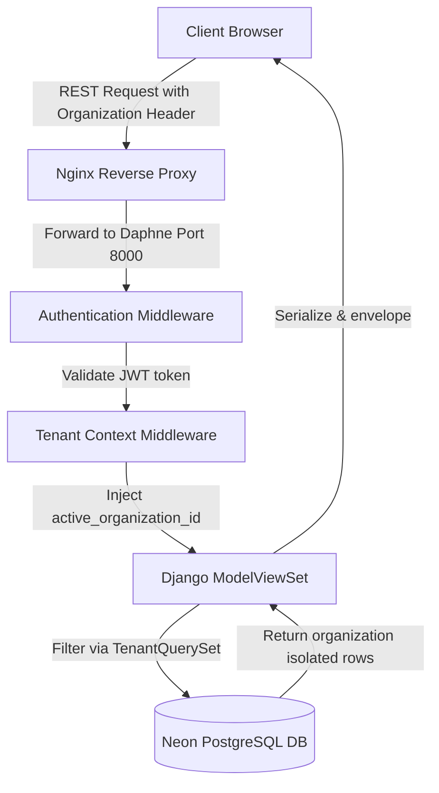

<div align="center">


[](https://git.io/typing-svg)

<p align="center">
  
  
  
  
  
  
</p>

**A premium, high-performance platform featuring real-time state synchronization, catalog compliance, AI-assisted generation, and strict audit log trails.**


</div>

## ✨ Table of Contents
<details open>
<summary><b>📖 Click to expand</b></summary>

1. [🚀 Project Overview](#-project-overview)
2. [🔥 Core Feature Showcase](#-core-feature-showcase)
3. [⚡ System Architecture](#-system-architecture)
4. [📡 Real-Time WebSocket Sync](#-real-time-websocket-sync)
5. [🛠️ Technology Stack](#-technology-stack)
6. [📥 Installation & Setup](#-installation--setup)
7. [🔌 API Documentation](#-api-documentation)
8. [🛡️ Security Architecture](#-security-architecture)

</details>

<div align="center">
  
</div>

## 🚀 Project Overview

**Invoicely** is a multi-tenant Invoice and Client Management SaaS designed for high-performance enterprise billing. 


### 🎯 The Problem It Solves
Modern financial systems suffer from data drift, laggy synchronization, and compliance issues. Invoicely fixes this through:
- 🔒 **Ledger Security & Data Isolation:** Strict RBAC and Tenant Query filters.
- ⚡ **WebSocket Real-Time Sync:** Instant UI refreshes across active users.
- 📋 **Catalog Compliance:** Invoice items locked strictly to catalog product prices.
- 📱 **Standardized 10-Digit Contacts:** Cleaned global directories.

<br><br>

<div align="center">
  
</div>

## 🔥 Core Feature Showcase

| 🌟 Feature | 🛠️ Implementation Detail |
| :--- | :--- |
| 🏢 **SaaS Tenancy** | Dynamic RBAC middleware intercepting SQL queries via `TenantQuerySet`. |
| 📡 **WebSockets** | Daphne ASGI gateway broadcasts live signals. Client UI reloads on `app:sync`. |
| 🔒 **Catalog Locking** | Immutable input cells validated against product SKU ledgers. |
| 🤖 **AI Smart Drafts** | NLP engine processing raw text ("consulting 75k") into invoice arrays. |
| 🖺 **OCR Extractor** | Parses images & PDFs to extract bill items and match inventory SKUs. |
| 🕵️ **Audit Trails** | Thread-safe `ContextVar` logging user actions, IPs, and payload deltas. |

<div align="center">
  
</div>

## ⚡ System Architecture

<details>
<summary><b>1️⃣ Multi-Tenant Data Flow (Click to expand)</b></summary>
<br>


</details>

<details>
<summary><b>2️⃣ Event-Driven Real-Time Topology (Click to expand)</b></summary>
<br>


</details>

<div align="center">
  
</div>

```mermaid
graph LR
    UserA[User A writes Customer] -->|POST Request| API[Django REST API]
    API -->|Save to Database| Signals[post_save Signal Receiver]
    Signals -->|Extract Org ID| GroupLayer[Channels Layer]
    GroupLayer -->|group_send| Daphne[Daphne Server]
    Daphne -->|WebSocket frame| WS[Client Browser]
    WS -->|Dispatch 'app:sync'| GlobalBus[Event Bus]
    GlobalBus -->|Reload UI| Dashboard[Dashboard View]
```

## 🛠️ Technology Stack

<div align="center">
  <table>
    <tr>
      <td align="center" width="33%">
        <h3>🎨 Frontend Core</h3>
        
        
        
        <br><b>React 18 • TypeScript • Tailwind</b>
      </td>
      <td align="center" width="33%">
        <h3>⚙️ Backend Core</h3>
        
        
        <br><b>Django 4.2 • REST Framework • Daphne</b>
      </td>
      <td align="center" width="33%">
        <h3>🗄️ Database & Infra</h3>
        
        
        <br><b>PostgreSQL • Redis • Celery</b>
      </td>
    </tr>
  </table>
</div>

<div align="center">
  
</div>

## 📥 Installation & Setup

1️⃣ **Clone the repository:**
```bash
git clone https://github.com/KandhalShakil/Invoice_Management_System.git
cd Invoice_Management_System
```

2️⃣ **Start the Backend:**
```bash
cd backend
python -m venv .venv
source .venv/bin/activate
pip install -r requirements.txt
python manage.py migrate
python seed_data.py
python manage.py runserver
```

3️⃣ **Start the Frontend:**
```bash
cd ../frontend
npm install
npm run dev
```

<div align="center">
  
</div>

## 🛡️ Security Architecture

> [!WARNING]
> Security is our top priority. We implement zero-trust policies inside our architecture.

- 🔑 **Context-Bound Isolation:** `TenantMiddleware` extracts active tenant IDs from custom headers. A thread-local `ContextVar` context ensures database actions query *only* records associated with the active organization.
- 🛑 **Brute Force Defense:** Django-Axes intercepts logins. If an IP executes **5 consecutive invalid attempts**, they are locked out.
- ⏱️ **API Throttling Rules:** IP and user throttles enforce security limits (e.g. `LoginRateThrottle` at 10 req/min).

<div align="center">
  
  
  <br>
  
  
</div>
